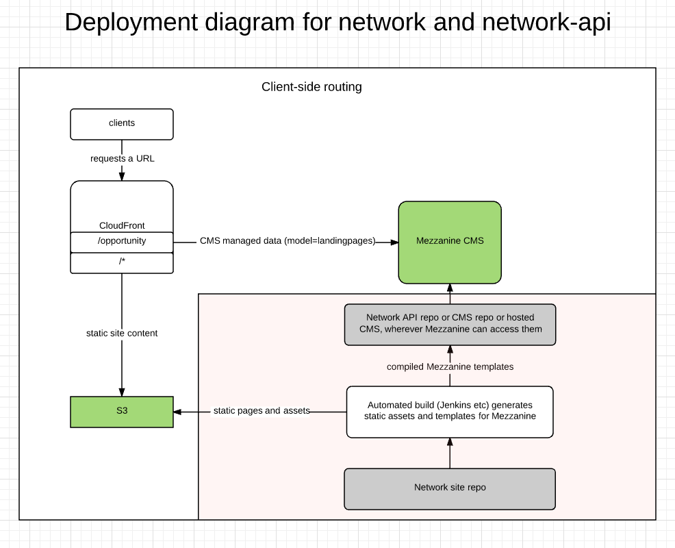

# Mozilla Network Site API

This is the REST API server for the Mozilla Network Site.

- [Requirements](#requirements)
- [Installation](#installation)
- [Bootstrap the install](#bootstrap-the-virtual-enviroment)
- [Setup](#setup)
  - [Environment Variables](#environment-variables)
- [Development](#development)
  - [Gotchas](#gotchas)
- [Deployment Considerations](#deployment-considerations)
- [Our deployment diagram](#our-deploymnet-diagram)

## Requirements

- `python3`, `pip`, optionally `virtualenv`

## Installation

Create a virtual environment using either `virtualenv` or `python3`'s virtual environment invocation. For the purposes of this README.md it is assumed you called this virtual environment `venv`.

#### Important note for systems with python *and* python3

In order to make sure your virtual environment will be using python 3.x you will have to explicitly tell the system it should use point to `python3` whenever it invokes python:

```
$ virtualenv -p python3 venv
```

## Bootstrap the virtual enviroment

Activate the virtual environment:

- Unix/Linux/OSX: `source venv/bin/activate`
- Windows: `venv\Scripts\Activate`

(for both, the virtual environment can be deactivated by running the corresponding "deactivate" command)

Install all dependencies into the virtual environment:

```bash
pip install -r requirements.txt
```

## Setup

Before you can run the site for local developement, you'll need to set up an `.env` file, run the initial database bootstrapping, and create a superuser:

```bash
cp env.default .env
python app/manage.py migrate
python app/manage.py createsuperuser
```

You can now run the server using:

```
python app/manage.py runserver
```

You should now be able to access the API on `localhost:5000`.

To log in to the admin UI, visit: http://localhost:8000/admin

### Environment Variables

As this is a Python/Django project, we also support additional commands that might be of use. Please consult the following table for some common commands you might want to use:

| No. | Command | Description |
| --- | ------- | ----------- |
| 1. | flake8 app --config=./app/tox.ini | Run Flake8 linting on the code.  |
| 2. | python app/manage.py test | Run the tests defined for this project. |
| 3. | python app/manage.py makemigrations | Create migration files for all Django model changes detected. |
| 4. | python app/manage.py migrate | Apply migrations to the database. |
| 5. | python app/manage.py shell | Open up a Python interactive shell. |
| 6. | python app/manage.py createsuperuser | Create a super user for the Django administrative interface. |
| 7. | python app/manage.py collectstatic | Create a folder containing all the static content that needs to be served for use by the API and the admin interface. |

## Development

This project is based on Mezzanine, which is itself based on Django, so the documentation for both projects applies. As far as Django is concerned, there is "good documentation" on the Django site but it's primarily considered good by people who already know Django, which is kind of bad. If this is your first foray into Django, you will want to read through https://djangobook.com/ instead.

### Overriding templates and static content

Sometimes it is necessary to override templates or static js/css/etc assets. In order to track *what* we changed in these files please surround your changes with:

```
# override: start #123
... override code here...
# override: end #123
```

Where `#...` is an issue number pointing to the issue that these changes are being made for.


### Gotchas

As this is REST API built on top of Django, there are some "gotcha!"s to keep in mind due to the high level of magic in the Django code base (where things will happen automatically without the code explicitly telling you).

#### **DEBUG=True**

The `DEBUG` flag does all sorts of magical things, to the point where testing with debugging turned on effectively runs a completely different setup compared to testing with debugging turned off. When debugging is on, the following things happen:

- Django uses its own built-in static content server, in which template tags may behave *differently* from the Mezzanine static server, which can lead to `400 Bad Request` errors in `DEBUG=False` setting.
- Django bypasses the `ALLOWED_HOST` restrictions, which again can lead to `400 Bad Request` errors in `DEBUG=False` setting.
- Rather than HTTP error pages, Django will generate stack traces pages that expose pretty much all enviroment variables except any that match certain substrings such as `KEY`, `PASS`, etc. for obvious security reasons.
- ...there are probably more gotchas just for `DEBUG` so if you find any please add them to this list.

#### Use of `{ static "...." }` in templates

Using the `static` tag in templates is supposed both in Django and Mezzanine, but they work differently: in Django, `{static "/..." }` works fine, but in Mezzanine this is a breaking pattern and there **should not** be a leading slash: `{ static "..." }`.

## Deployment considerations

If you're deploying this application behind a proxy or CDN (like CloudFront) be sure that the `X-Forwarded-Host` header is forwarded to the server, and that `USE_X_FORWARDED_HOST` is set to `True` in your server environment.

## Our deployment diagram

[](https://www.lucidchart.com/documents/edit/72261654-23d0-491c-b67e-c026abbafcd3)
